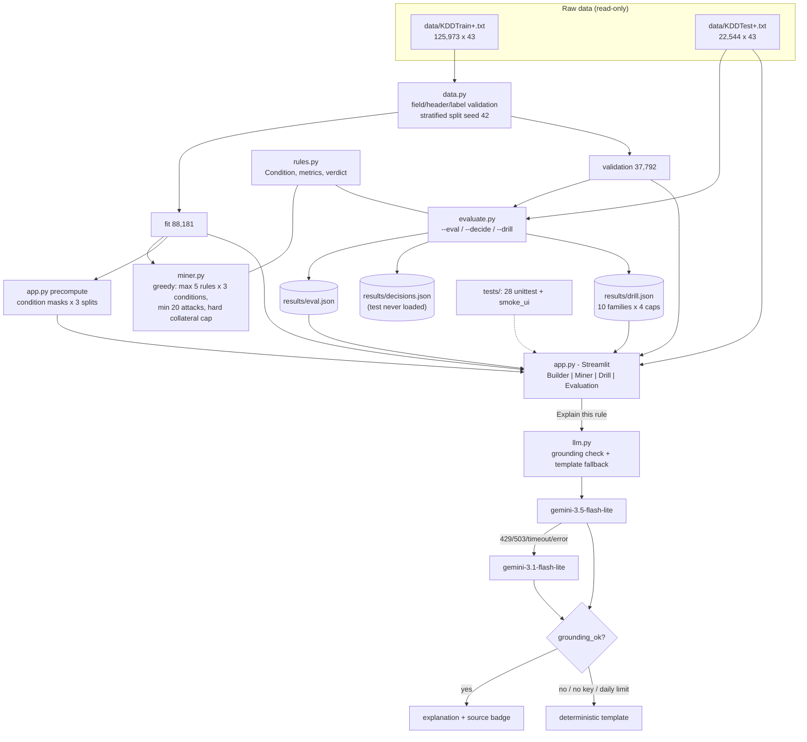

# RuleLab

Firewall-rule safety simulator on the NSL-KDD intrusion-detection dataset.
Build or mine rules, watch the live collateral meter, and measure how a rule
trained without an attack family behaves when that family shows up anyway.

- **Problem:** a firewall rule that blocks attacks also blocks legitimate
  ("labeled normal") traffic. Before deploying, an administrator needs to know
  (a) how much normal traffic the rule would take down, (b) how that changes
  when the traffic is not the data the rule was tuned on, and (c) what happens
  with attack families the rule has never seen.
- **User:** a network or security administrator evaluating firewall rules
  (the persona stated in the RuleLab explanation system prompt, `llm.py:26`).
- **Stack:** Python 3.13.5, pandas, numpy, Streamlit 1.65.0; optional Gemini
  API for natural-language explanations. Four pinned dependencies
  (`requirements.txt`), no GPU, no database.

## USP 1 - Live collateral meter (and how it is proven)

The Builder tab evaluates any rule you assemble against **Validation** and
**KDDTest+** side by side, in the same render: attacks blocked, normal blocked
(collateral), precision, verdict pill, cap-drift, cap-usage gauge, and a
per-family table (percentages hidden as `n<30` for families under 30 rows).
Values are computed from precomputed condition masks, so moving a slider
updates both columns immediately.

Proof (all checks are in `tests/smoke_ui.py`, run = 19/19 PASS, wall 68.9 s):

| Check | What it proves | Result |
|---|---|---|
| `p05_c1_both_columns` | both dataset columns render attacks + normal metrics | PASS |
| `p05_c2_slider_move_changes_both` | moving one slider changes attacks blocked AND normal blocked in the same render | PASS |
| `p05_c3_median_under_100ms` | 50 evaluations of a 3-condition rule over all 37,792 validation rows: median 34.12 ms, p95 43.20 ms (< 100 ms target) | PASS |
| `p05_c4_preset_*` | the "flag = S0" preset shows exactly the B0 numbers recorded in `results/eval.json` on both splits | PASS |
| `p05_c5_delta_appears` | delta arrows appear after a change | PASS |
| `p05_c6_n_lt_30_rows` | families with < 30 rows show `n<30`, never a percentage | PASS |

## USP 2 - Zero-day rule drill (and how it is proven)

The drill removes **every row of one attack family from the fit split**,
re-mines rules on the remainder, and compares recall of the *seen* rule set
vs the *unseen* (family-excluded) rule set on validation and test. It runs for
all eligible families (n_train >= 100: 10 families) at all 4 caps, written to
`results/drill.json`.

Proof:

- Every one of the 40 family x cap entries in `results/drill.json` passes its
  three assertions: `assert_0_f_rows_in_unseen_fit`, `normal_rows_untouched`,
  `identities_ok` (verified: 0 failures).
- `p06_c6_rerun_matches_json` (PASS): a live re-run in the UI reproduces
  drill.json exactly for neptune at 1% cap - seen val recall 0.834115,
  unseen 0.010919 (live runtime 1.9 s).
- `p06_c6_two_families_render`, `p06_c6_rerun_no_exception`: PASS.
- Honest result, not a curated one: at the default 1% cap, **0 of 10 reliable
  families keep >= 50% unseen validation recall**; median seen-unseen gap
  0.00 pp. Only neptune separates (seen 83.41% vs unseen 1.09%, gap
  82.32 pp) - the mined rules mostly encode neptune-like patterns.

## Dataset

NSL-KDD (files in `data/`, loaded by `data.py` with hard validation):

| | KDDTrain+.txt | KDDTest+.txt |
|---|---|---|
| rows x fields | 125,973 x 43 | 22,544 x 43 |
| distinct labels | 23 | 38 (17 of them absent from train) |
| largest label | normal 67,343 | normal 9,711 |
| null cells | 0 | 0 |
| difficulty range | 0-21 | 0-21 |

41 features are used (38 numeric + 3 categorical: protocol_type, service,
flag); `label` and `difficulty` are excluded. Train is split 70/30
stratified by label, seed 42: fit 88,181 rows (41,041 attacks), validation
37,792 rows (17,589 attacks), fit-index sha256
`b7d540719ba6389d0742072aebd79331f6fbbf916864e0efcc17f06ab6ccc50d`.
KDDTest+ (22,544 rows) is held out entirely.

## Architecture



## Data flow

1. `data.py` reads a file only if every line has exactly 43 fields, the first
   field is numeric (no header), the label column is non-numeric and the
   difficulty column numeric; labels are lowercased and trailing dots stripped.
2. `split_fit_val` stratifies by label (seed 42) and tags each split
   (`fit.attrs["split"] = "fit"`).
3. `miner.py::mine` accepts **fit rows only** (asserted) and greedily grows up
   to 5 rules of up to 3 conditions, score = TP - lambda*FP, stopping before
   cumulative fit false positives would exceed the cap.
4. `evaluate.py` scores B0 (fixed `flag == S0`), B1 (1 rule, 1 condition) and
   B2 (full miner) at caps 0.1/0.5/1.0/2.0% on fit/validation/test and writes
   `results/eval.json` (5 verification checks V1-V5 must pass).
   `--decide` refuses to load KDDTest+ (loader patched to raise) and writes
   `results/decisions.json`; `--drill` writes `results/drill.json`.
5. `app.py` reads the JSON files (or shows the exact command to create them)
   and computes Builder metrics from cached condition masks - no file is
   re-mined on page load.

## AI flow (optional)

"Explain this rule" builds a JSON context of the numbers already on screen
(rule text, recall/collateral/precision/verdict per dataset) and calls
`llm.py::explain`:

1. cache hit -> cached text, no request;
2. missing `GEMINI_API_KEY` -> deterministic template ("missing API key");
3. daily usage >= 450 (`results/llm_usage.json`) -> template ("daily limit");
4. otherwise POST to `generativelanguage.googleapis.com/v1beta/models/
   {model}:generateContent`, key in the `x-goog-api-key` header only,
   temperature 0.2, maxOutputTokens 300, 30 s timeout, >= 4.5 s between calls;
5. primary model first (1 retry on timeout/429/503), then backup model;
6. every number in the reply must appear in the context (`grounding_ok`) or
   the template is used ("grounding failed");
7. the UI shows a source badge: `primary`, `backup`, or `template`.
   Nothing is called on app load (0 HTTP calls, verified by smoke test).

**Model IDs used (pinned, from `config.py`):** primary
`gemini-3.5-flash-lite`, fallback `gemini-3.1-flash-lite`.

## Measured results (copied from `results/eval.json`, run 2026-10-09T13:34:53Z)

Verification checks - all true:

| Check | Detail recorded in the file |
|---|---|
| V1 | 5 fixed rules match df.query() on fit |
| V2 | 12 entries x 3 splits consistent |
| V3 | 5 rules identical across 2 runs at cap 0.01 |
| V4 | B2 fit collateral <= cap at every cap |
| V5 | mine() rejected val and test rows |

Split sizes: fit 88,181 / validation 37,792 / test 22,544; runtime_s 17.29;
max_rules 5, max_conds 3, min_tp 20; fallback_max_conds null (fallback never
triggered).

All 12 entries (collateral and drift in %, recalls as fractions):

| cap | method | rules | val collateral % | val recall | val macro-recall | test collateral % | test recall |
|---|---|---|---|---|---|---|---|
| 0.1% | B0 | 1 | 0.4900 | 0.5889 | 0.0809 | 0.0000 | 0.1569 |
| 0.1% | B1 | 1 | 0.0346 | 0.5836 | 0.0970 | 0.0309 | 0.1318 |
| 0.1% | B2 | 5 | 0.0000 | 0.5692 | 0.0787 | 0.0000 | 0.1253 |
| 0.5% | B0 | 1 | 0.4900 | 0.5889 | 0.0809 | 0.0000 | 0.1569 |
| 0.5% | B1 | 1 | 0.0346 | 0.5836 | 0.0970 | 0.0309 | 0.1318 |
| 0.5% | B2 | 5 | 0.0000 | 0.5903 | 0.0824 | 0.0000 | 0.1331 |
| 1.0% | B0 | 1 | 0.4900 | 0.5889 | 0.0809 | 0.0000 | 0.1569 |
| 1.0% | B1 | 1 | 0.0346 | 0.5836 | 0.0970 | 0.0309 | 0.1318 |
| 1.0% | B2 | 5 | 0.0000 | 0.5903 | 0.0824 | 0.0000 | 0.1331 |
| 2.0% | B0 | 1 | 0.4900 | 0.5889 | 0.0809 | 0.0000 | 0.1569 |
| 2.0% | B1 | 1 | 0.0346 | 0.5836 | 0.0970 | 0.0309 | 0.1318 |
| 2.0% | B2 | 5 | 0.0000 | 0.5940 | 0.0977 | 0.0206 | 0.1385 |

Default-cap B2 rule set (cap 1.0%, rule_text copied from the file):
`dst_host_srv_serror_rate >= 1 AND flag == S0 AND dst_host_diff_srv_rate >= 0.02 ;
service == Z39_50 ; service == uucp ; service == bgp ; service == uucp_path`

From `results/decisions.json` (validation only, test not loaded):
DRIFT_TOL = 0.0025 (0.25 pp; max observed val-fit drift 0.0000 pp over 4
caps, rounded up to the 0.25 pp floor); RECOMMENDED_CAP = 0.02
("highest val macro-recall 0.0977 among 4 SAFE caps"; per-cap val
macro-recall 0.0787 / 0.0824 / 0.0824 / 0.0977, all verdict SAFE).

From `results/drill.json` (runtime_s 48.27, 10 families x 4 caps), the summary
sentence stored in the file:
"10 eligible families at cap 1.0%: 0 of 10 reliable families (n_val>=30) keep
unseen validation recall >= 50%; median seen-unseen validation recall gap
0.00 pp."

Test suite: `python -m unittest discover tests` -> Ran 28 tests, OK (0.076 s).
UI smoke: 19/19 checks PASS (68.9 s wall). Cold-start runtimes on this
machine: `--eval` 17.29 s (in-file), `--decide` 14.8 s (wall), `--drill`
48.27 s (in-file), KDDTrain+ load 3.69 s, KDDTest+ load 0.61 s.

## Run instructions

Verified on Windows PowerShell with the repository venv (Python 3.13.5).
All commands below were executed successfully as written.

```powershell
# one-time setup: venv creation was verified against a scratch path,
# pip install -r was verified in this repository
python -m venv .venv
.\.venv\Scripts\python.exe -m pip install -r requirements.txt

# dataset schema report (6.8 s wall on this machine) (verified)
.\.venv\Scripts\python.exe data.py

# produce results/eval.json (~17 s), exits non-zero if any check fails (verified)
.\.venv\Scripts\python.exe evaluate.py --eval

# produce results/decisions.json, never loads KDDTest+ (~15 s) (verified)
.\.venv\Scripts\python.exe evaluate.py --decide

# produce results/drill.json, 10 families x 4 caps (~48 s) (verified)
.\.venv\Scripts\python.exe evaluate.py --drill

# tests (verified)
.\.venv\Scripts\python.exe -m unittest discover tests     # 28 tests
.\.venv\Scripts\python.exe tests\smoke_ui.py              # 19 checks

# UI (verified: server starts and answers on its port)
.\.venv\Scripts\python.exe -m streamlit run app.py
```

The Evaluation and Drill tabs need their JSON files; if missing they print the
exact command that creates them. Explanations work without any key (template
text) - set the key only if you want model output.

## Environment variables

Read by `config.py` via `os.getenv`; `.env.example` lists the names.

| Variable | Default | Meaning |
|---|---|---|
| `GEMINI_API_KEY` | (empty) | enables model explanations; missing/empty -> template, no request |
| `GEMINI_MODEL` | `gemini-3.5-flash-lite` | primary model |
| `GEMINI_FALLBACK_MODEL` | `gemini-3.1-flash-lite` | tried after primary failure |

Note: a `.env` file is auto-loaded at startup via `python-dotenv`
(1.2.4); variables already set in the shell take precedence.

## Limitations (honest)

1. NSL-KDD is a 1999-era simulation, not real network traffic; the app shows
   this as a permanent banner.
2. "Collateral" counts labeled-normal rows only - it is not a business-cost
   estimate and has no notion of traffic volume or importance.
3. Rule sets are conservative: the best SAFE validation macro-recall across
   caps is 0.0977, i.e. most families are barely covered.
4. Generalization gap: B2 validation recall 0.5692-0.5940 vs test recall
   0.1253-0.1385 - KDDTest+ distribution differs from the train split.
5. The drill's honest outcome is that the miner does not learn most families:
   0/10 reach >= 50% unseen validation recall at 1% cap; only neptune shows a
   real seen/unseen gap (82.32 pp).
6. 17 attack families appear only in KDDTest+ and can never be trained on;
   very small families are shown as `n<30` instead of percentages.
7. The miner is greedy (not optimal), capped at 5 rules x 3 conditions,
   single seed 42, no cross-validation; the `difficulty` column is validated
   but never used as a feature.
8. The collateral cap is enforced on the fit split only; validation/test
   collateral is measured, not guaranteed (e.g. 0.0206% on test at cap 2%).
9. Verdict thresholds (UNSAFE > 2%, CAUTION > 0.5% or drift > 0.25 pp,
   LOW EVIDENCE < 20 attacks) are fixed product rules documented in
   `DECISIONS.md`, not learned from data.
10. The LLM layer is optional garnish: subject to a 450-calls/day budget, a
    heuristic grounding check, and template fallback; explanations are not
    needed for any metric in the app. `.env` is auto-loaded via
    `python-dotenv`.
11. This is an offline simulator: it does not read live traffic, talk to
    firewalls, or deploy rules.
12. Performance figures are from single runs on this machine and will vary.

## Files

```
config.py            constants: split, caps, thresholds, model IDs, columns
data.py              loader + schema report + stratified split
rules.py             Condition, mask evaluation, metrics, verdict
miner.py             greedy rule miner (fit split only, hard cap)
evaluate.py          --eval / --decide / --drill -> results/*.json
llm.py               Gemini calls, grounding check, template fallback
app.py               Streamlit UI (Builder, Miner, Drill, Evaluation)
.streamlit/config.toml  dark theme
requirements.txt     numpy, pandas, requests, streamlit (pinned)
.env.example         environment variable names
DECISIONS.md         provenance of every threshold value
tests/               test_rules.py (18), test_llm.py (10), smoke_ui.py (19)
data/                KDDTrain+.txt, KDDTest+.txt (read-only inputs)
results/             eval.json, decisions.json, drill.json (+ llm_usage.json
                     after the first model call)
README.md            this file
PROJECT_DOCUMENTATION.pdf  this document in PDF form
```
